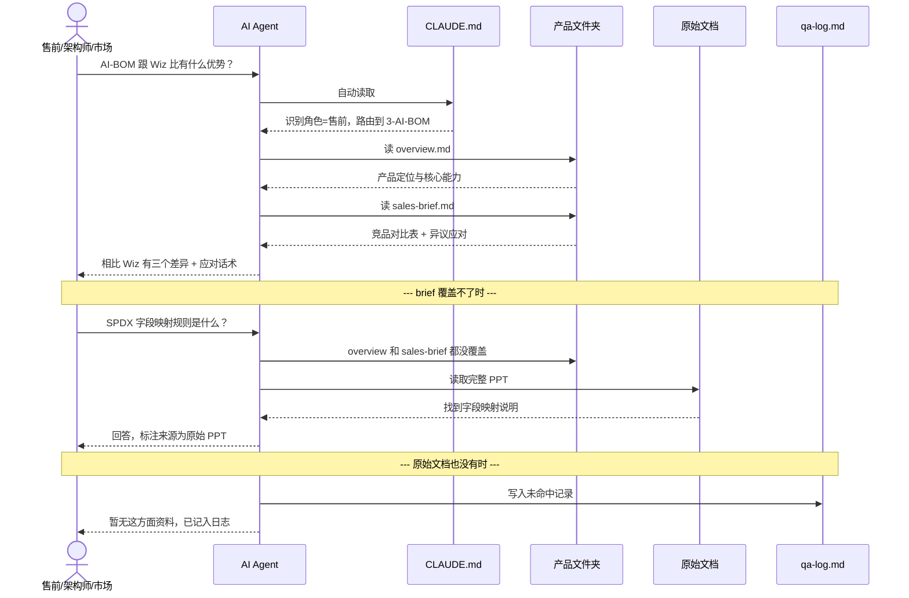
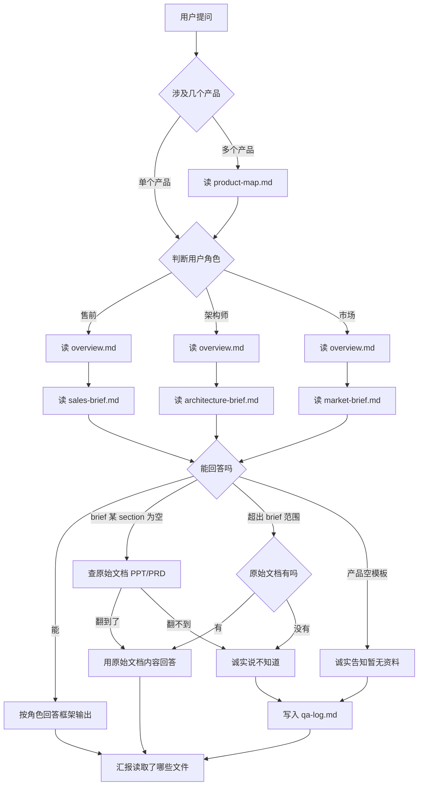
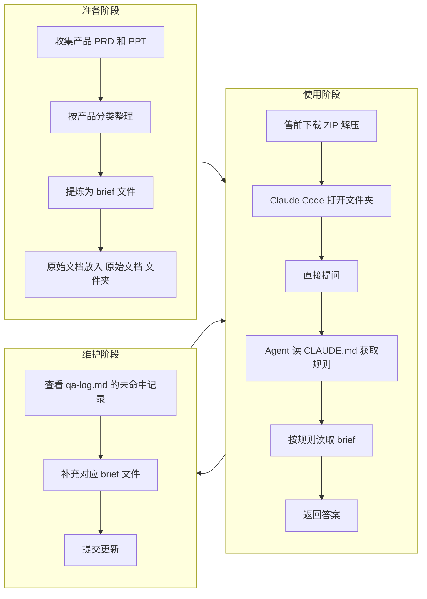

# agent-security-briefs 核心逻辑

---

## 一、时序图：一次完整问答



---

## 二、流程图：Agent 决策链



> 相比旧版的关键改动：brief 里标注"待补充"的 section，不能直接跳过——必须先翻原始文档（铁律第 7 条）。

---

## 三、全景图：准备 → 使用 → 维护闭环



---

## 四、七个核心设计点

### 1. CLAUDE.md 是整个系统的发动机

```
CLAUDE.md 定义了这些事：

  1. 角色识别关键词雷达 → "客户""卖点"=售前，"架构""接口"=架构师，"热点""PR"=市场
  2. 每个角色读什么文件 → 售前=overview+sales，架构师=overview+arch，市场=overview+market
  3. 每个角色的回答框架 → 售前=结论→差异→对比→应对，架构师=白话→技术→边界→短板，市场=匹配→角度→产品→操作
  4. 答不上来怎么办 → brief 空的先翻原始文档（铁律第 7 条），还没有就记 qa-log
  5. 怎么汇报 → 回答后标注读了哪些文件，有无推断项
  6. 铁律 → 不编造、先读后答、空模板说不知道、brief 空白≠没资料
```

**关键原则：规则写得越具体，AI 回答越稳。** 不是"根据不同角色灵活回答"，而是"遇到 X 信号 → 执行 Y 步骤"。每个角色都有一个结构化的回答框架，AI 不需要自己发明怎么组织答案。

### 2. AGENTS.md 是多 Agent 兼容入口

```
CLAUDE.md    ← Claude Code 专属，自动加载
AGENTS.md    ← Cursor、Copilot、Gemini CLI、Windsurf 等通用入口
               内容极简，指向 CLAUDE.md，不维护两份规则
```

AGENTS.md 本身只有几行，作用是让不识别 CLAUDE.md 的 AI 工具也能找到项目指令。所有规则仍然只在 CLAUDE.md 里维护。

### 3. 三层信息递进，逐级兜底

```
第一层：overview.md             ← 一句话定位+核心能力+典型场景，覆盖 70% 日常问题
第二层：sales / arch / market   ← 角色专属深度信息（异议应对、技术壁垒、传播速配）
第三层：原始文档 / PRD.pptx     ← 完整原文，兜底
```

大部分问题在第一层就能回答。到了第三层，说明 brief 有盲区——这种问题必须记 qa-log。

**重要：brief 中标"待补充"的 section ≠ 可以直接跳过。** 铁律第 7 条要求先去原始文档翻，翻不到才能说不知道。

### 4. brief 设计原则：有深度，不注水

```
每个 brief 控制在 60-80 行，不追求字数，追求密度：

  overview.md       → 加典型场景（按行业分），加商业模式
  sales-brief.md    → 加客户异议应对表（客户说 XX → 回应 YY），加部署FAQ
  market-brief.md   → 加媒体×角度速配表，加合规传播素材
  architecture-brief.md → 加技术壁垒对标表，技术债务不回避
```

brief 不是 PRD 的缩水版，而是"售前/架构师/市场最常被问到的 20 个问题"的答案集。

### 5. qa-log.md 是增长引擎

```
答不上来 → 记日志 → 人补充 brief → 下次就能答
```

日志不是甩锅本，是知识缺口清单。每个未命中条目都是一条"该补什么"的线索。维护阶段的核心动作就是看 qa-log 反哺 brief。

### 6. 文件即数据库，零依赖

没有 API、没有脚本、没有数据库。AI 直接 Read Markdown 文件。好处：

- 即插即用，下载 ZIP 就能用
- 任何支持 CLAUDE.md 或 AGENTS.md 的 AI 工具都兼容
- Markdown 人类也能直接打开看

代价：回答质量完全取决于文档质量。文档写得好就答得好，文档烂就答得烂。

### 7. 准确性 > 信息量

铁律第一条"不编造"是最重要的。宁可说五次"不知道"，也不要编一次。

- 每次回答标注来源文件
- 推断性结论标注"此为推断"
- 原始文档也找不到的，诚实说不知道 + 记日志
- brief 空的 ≠ 没资料，先去翻原始文档

---

## 五、与 legal-ai 的关键差异

| 维度 | legal-ai | agent-security-briefs |
|---|---|---|
| 数据性质 | 法律材料，持续增长 | 产品信息，低频更新 |
| 搜索方式 | Python 脚本全量扫描 | Agent 直接读对应文件 |
| 知识结构 | raw + source 双层 | overview + 角色 brief + 原始文档 |
| 受众 | 一种角色（律师） | 三种角色（售前/架构师/市场） |
| 系统入口 | SKILL.md（需 YAML 头部匹配） | CLAUDE.md + AGENTS.md（双入口） |
| 角色识别 | 无（单一角色） | 关键词雷达自动判定 |
| 回答框架 | 无（自由回答） | 三种角色各有一套结构化回答模板 |
| 环境依赖 | 需要 Python + 库 | 纯文本，零依赖 |
| 增长方式 | 律师持续入库新材料 | 根据 qa-log 补充 brief |

---

## 维护日志

- 2026-07-06：根据 CLAUDE.md 增强版和 brief 重写版更新本文档，新增 AGENTS.md 说明、brief 设计原则、铁律第 7 条在流程中的体现
